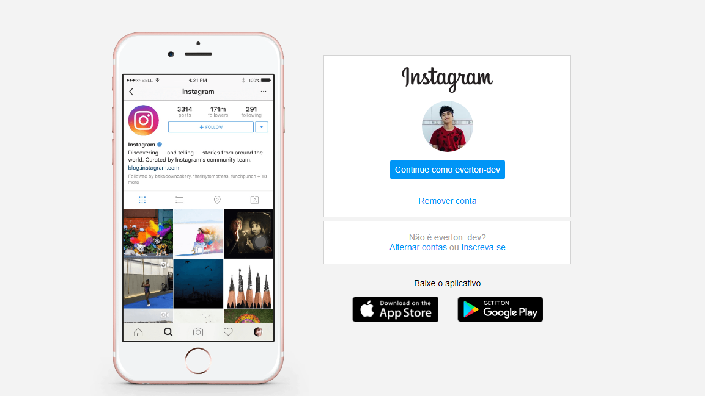

# Clone da interface de Login do Instagram Simples🙃
Esse projeto simples tem como objetivo aplicar os conceitos de FlexBox e Responsividade.

###### O foco é apenas aplicar os conceitos mencionados e não clonar uma cópia exata do Instagram.

## Tela de Login clonada 

## Tecnologias usadas 🚀
- HTML5
- CSS3

## Licença
LICENSE
https://github.com/Everton-Victor/Clonando-Interface-Instagram/blob/master/LICENSE

